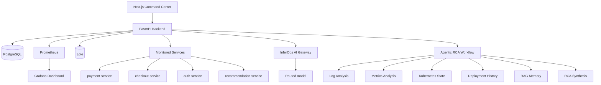

# AegisOps AI — Agentic Incident Commander

> Turn production alerts into autonomous, multi-agent incident response — evidence
> collection, root-cause analysis, safety-gated runbooks, postmortems, and continuous
> RCA evaluation, with full Prometheus/Grafana observability.

AegisOps AI is an agentic incident-response platform for production systems. When an
incident is opened, a fleet of specialized agents collects evidence in parallel, an RCA
agent synthesizes a confidence-scored root cause, risky remediations are gated behind
human approval, and the whole timeline is captured, scored, and observable.

It runs alongside an LLM gateway such as **InferOps AI**:

```text
AegisOps AI = the agentic incident-response application
InferOps AI = the LLM routing / safety / RAG / observability gateway
```

When `INFEROPS_AI_URL` is configured, AegisOps routes root-cause synthesis through the
gateway and records provider, model, latency, tokens, and cost. If the gateway is
unavailable, a deterministic fallback keeps the platform fully operational.


---

## Table of contents

- [Capabilities](#capabilities)
- [Product tour](#product-tour)
- [Architecture](#architecture)
- [Tech stack](#tech-stack)
- [Run locally](#run-locally)
- [Workflow](#workflow)
- [Fault injection](#fault-injection)
- [Connecting InferOps AI](#connecting-inferops-ai)
- [Integrations](#integrations)
- [Key API endpoints](#key-api-endpoints)
- [Observability metrics](#observability-metrics)
- [Project layout](#project-layout)
- [Kubernetes](#kubernetes)

## Capabilities

- **Multi-agent investigation** — Log, Metrics, Kubernetes-State, Deployment-History,
  and RAG-Memory agents collect evidence in parallel, feeding an RCA agent.
- **Root-cause analysis** — RCA synthesis via the InferOps AI gateway with a confidence
  score, recommended safe actions, and risky actions gated behind human approval.
- **Safety-gated runbooks** — YAML runbooks execute only after explicit approval and run
  in simulation mode, so no live infrastructure is mutated without sign-off.
- **AI-generated postmortems** — structured Markdown postmortems built from the full
  incident context.
- **Continuous RCA evaluation** — a benchmark scores analysis quality against known
  incidents so accuracy is measured and tracked over time.
- **Live observability** — Prometheus metrics, a provisioned Grafana dashboard, Loki log
  search, and OpenTelemetry instrumentation.
- **Real integrations** — Loki, the Kubernetes API adapter, Slack/PagerDuty
  notifications, RAG memory over past incidents and runbooks, and InferOps cost/latency
  tracking.
- **Immersive UI** — a Next.js command center with a live 3D service topology, animated
  workflow, and dedicated incident, evaluation, and integration views.

## Product tour

### Command center

The home view: triage queue on the left, a live 3D service topology (nodes colored by
health), animated metrics, and the full agentic workflow — open an incident, run RCA,
approve a runbook, generate a postmortem, run a benchmark.


### Incident detail

A confidence-scored root cause, the raw evidence records each agent produced, agent
execution traces with latencies, and a chronological timeline.


### Integrations control center

Exercise every live integration from the browser — Loki log search, the Kubernetes
adapter, Slack/PagerDuty notifications, RAG memory, and InferOps model usage.


### Evaluation center

Run the RCA benchmark and track correctness scores so analysis quality is held
accountable over time.


### Grafana observability

A provisioned dashboard with live incident, agent, model, and service-health metrics,
refreshing every 5 seconds.


## Architecture



Evidence collection degrades gracefully: each agent reads live signals from the
monitored services and Loki when available, and falls back to scenario fixtures
otherwise, so the workflow always runs end to end.

## Tech stack

| Layer | Tools |
|---|---|
| Backend | FastAPI, SQLAlchemy, PostgreSQL |
| Frontend | Next.js 15, React 19, TypeScript, Tailwind, Framer Motion, react-three-fiber (3D) |
| Agents | Python agent classes, tool adapters, InferOps AI gateway |
| Monitored services | FastAPI microservices exposing real Prometheus metrics |
| Observability | Prometheus, Grafana, Loki, OpenTelemetry |
| Deployment | Docker Compose, Kubernetes manifests, GitHub Actions |

## Run locally

From the project root:

```powershell
cd deployment
docker compose down -v
docker compose up --build
```

The first build takes a few minutes. Wait until the backend logs show Uvicorn listening
on `:8000`, then open:

| Surface | URL |
|---|---|
| Command center | http://localhost:3000 |
| Incident center | http://localhost:3000/incidents |
| Evaluation center | http://localhost:3000/evals |
| Integrations | http://localhost:3000/integrations |
| Backend API docs | http://localhost:8000/docs |
| Prometheus | http://localhost:9090 |
| Grafana (admin / admin) | http://localhost:3001 |

## Workflow

1. Open `http://localhost:3000`.
2. Pick a scenario (e.g. **Payment API latency spike**) and click **Open incident**.
3. Click **Run RCA** to launch the agentic workflow.
4. Review the overview, evidence, agents, timeline, postmortem, and evals tabs.
5. Click **Approve restart** to run a safety-gated runbook in simulation mode.
6. Click **Postmortem** to generate a structured writeup.
7. Click **Benchmark** to score RCA quality.
8. Open Grafana to watch the metrics update live.

## Fault injection

The platform ships with a fleet of monitored microservices that emit real Prometheus
metrics and can be driven into realistic failure states. Use the **Fault injection**
controls on `http://localhost:3000/incidents`, or call the backend directly.

> On Windows PowerShell, `curl` is an alias for `Invoke-WebRequest` (which has no `-X`
> flag). Use `curl.exe` or `Invoke-RestMethod` for the `POST` calls below.

```powershell
curl.exe -X POST http://localhost:8000/services/payment-service/simulate-failure
curl.exe http://localhost:8000/services/payment-service/signals
```

Injecting a fault pushes the service's log lines into Loki. During analysis the
`LogAnalysisAgent` searches Loki first and falls back to direct service logs, then to
scenario fixtures.

## Connecting InferOps AI

Set these before starting Compose. Compose reads them from your shell or a `.env` next to
the compose file (`deployment/.env`):

```env
INFEROPS_AI_URL=https://your-inferops-url.com
INFEROPS_API_KEY=optional-token
OPENAI_MODEL=gpt-4.1-mini
```

```powershell
cd deployment
docker compose --env-file ..\.env up -d --force-recreate backend
```

Confirm the gateway is enabled and that a call was recorded after running an analysis:

```powershell
docker compose exec backend printenv INFEROPS_AI_URL
Invoke-RestMethod http://localhost:8000/model-usage   # total_calls > 0 when live
```

All live LLM traffic flows through `INFEROPS_AI_URL`; if it is unset or unreachable, the
deterministic fallback RCA is used and `model-usage` stays at zero.

## Integrations

| Integration | What it does | Env |
|---|---|---|
| **Loki** | Real log search; fault injection pushes logs, `LogAnalysisAgent` queries them | `LOKI_URL` |
| **Kubernetes adapter** | `KubernetesStateAgent` reads live pod/deployment state | `ENABLE_K8S_ADAPTER`, `KUBECONFIG_PATH` |
| **Slack / PagerDuty** | Sends notifications on incident creation and RCA completion; records simulated events when keys are unset | `SLACK_WEBHOOK_URL`, `PAGERDUTY_ROUTING_KEY` |
| **RAG memory** | Indexes incidents, RCA reports, evidence, and runbooks; `RagMemoryAgent` retrieves similar history | — |
| **InferOps AI** | RCA synthesis with provider/model/latency/token/cost tracking | `INFEROPS_AI_URL`, `INFEROPS_API_KEY` |

The Integrations page (`/integrations`) drives all of these from the browser. The
Kubernetes adapter is off by default and falls back to service-reported Kubernetes
signals when disabled.

## Key API endpoints

| Endpoint | Purpose |
|---|---|
| `GET /scenarios` | List incident scenarios |
| `POST /incidents/from-scenario/{key}` | Open an incident from a scenario |
| `POST /incidents/{id}/analyze` | Run the agentic RCA workflow |
| `GET /incidents/{id}` | Incident detail with evidence, traces, timeline |
| `POST /runbooks/approve` | Approval-gated runbook execution |
| `POST /incidents/{id}/postmortem` | Generate an incident postmortem |
| `POST /evals/run-benchmark` | Run the RCA benchmark |
| `POST /services/{service}/simulate-failure` | Inject a fault and push logs to Loki |
| `GET /logs/search` | Search service logs in Loki |
| `GET /kubernetes/{service}/status` | Query the Kubernetes adapter |
| `GET /model-usage` | InferOps AI cost and latency |
| `GET /metrics` | Prometheus metrics |

## Observability metrics

```text
aegisops_incidents_created_total
aegisops_rca_requests_total
aegisops_rca_latency_seconds
aegisops_ai_confidence_score
aegisops_runbook_executions_total
aegisops_latest_eval_score
aegisops_service_faults_total
aegisops_model_latency_seconds
aegisops_model_cost_usd_total
aegisops_model_tokens_total
aegisops_notifications_sent_total
aegisops_loki_queries_total
aegisops_k8s_adapter_calls_total
aegisops_rag_queries_total
```

> Prometheus counters live in the backend process, so they reset when the backend
> container is rebuilt. Incident and runbook history is persisted in PostgreSQL and
> always reflected in the UI; re-running a workflow repopulates the counters.

## Project layout

```text
aegisops-ai/
├── backend/            FastAPI app — agents, services, runbooks, metrics
│   └── app/
│       ├── agents/         RCA + safety agents
│       ├── services/       orchestration, evidence collectors, integrations
│       ├── data/           incident scenarios
│       └── runbooks/        YAML runbooks
├── frontend/           Next.js command center
│   ├── app/                routes: command, incidents, evals, integrations
│   ├── components/         UI kit, nav, animated background, 3D topology
│   └── lib/                API client + types, formatting helpers
├── services/           monitored FastAPI microservices (Prometheus metrics)
├── observability/      Prometheus, Grafana dashboards, Loki config
└── deployment/         Docker Compose + Kubernetes manifests
```

## Kubernetes

Manifests for the backend, frontend, and monitored services live in
[`deployment/k8s/`](deployment/k8s/). A local Kind walkthrough is in
[`deployment/k8s/KIND_QUICKSTART.md`](deployment/k8s/KIND_QUICKSTART.md).
