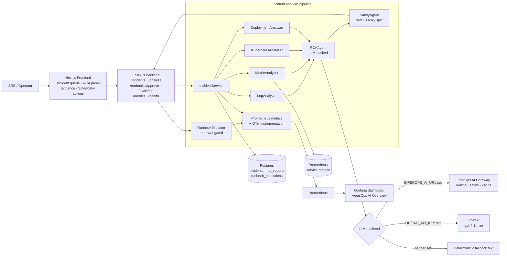

# AegisOps AI — Agentic AI Incident Commander for Production Systems

AegisOps AI is a production-style **agentic GenAI incident response platform**. It sits on top of your production stack and handles the operational concerns a real incident response loop needs: multi-source evidence collection (logs, metrics, Kubernetes, deployment history), LLM-driven root-cause analysis, safety-classified action recommendations, approval-gated runbook execution, deterministic RCA evaluation, and end-to-end Prometheus + Grafana observability.

This project is designed for AI Deployment Engineer, GenAI Engineer, Agentic AI Engineer, AI Platform Engineer, and LLMOps/MLOps roles.

---

## 1. Why this project matters

Most "AI for SRE" demos stop at "alert in → summary out". A real incident commander has to answer:

- Which signals actually correlate with this incident — logs, metrics, pod state, or the last deploy?
- Should the AI ever execute a destructive action on its own, or only after a human signs off?
- How do we make the boundary between **safe** and **risky** actions explicit and auditable?
- How do we measure RCA quality so the agent does not silently regress?
- How do we trace every incident, every analysis, and every runbook decision end-to-end?
- How do we plug a domain-specific incident agent into an existing LLM gateway instead of hard-coding a single provider?

AegisOps AI implements each of these as a first-class concern with metrics, a Grafana dashboard, and a Next.js console to inspect every decision the agent made.

---

## 2. Core features

| Area | Capability |
|---|---|
| Agentic workflow | Multi-stage incident pipeline: evidence collection → LLM RCA → safety classification → approval-gated runbook |
| Evidence collection | Pluggable analyzers for logs, Prometheus metrics, Kubernetes pod state, and deployment history |
| Root-cause analysis | LLM-backed RCA via OpenAI **or** a deployed InferOps AI gateway, with a deterministic fallback if both are absent |
| Safety layer | Keyword-driven `SafetyAgent` that splits recommended actions into **safe** vs **risky** and forces human approval on risky ones |
| Approval-gated execution | Runbooks (`restart_service`, `rollback_deployment`, `scale_service`) execute only after explicit human approval |
| Persistence | PostgreSQL stores every incident, RCA report, and runbook execution with full audit trail |
| Evaluation | `/evals/rca` scores RCA against a ground-truth root cause using keyword-overlap (MVP) |
| Observability | Prometheus metrics + Grafana auto-provisioned dashboard + OpenTelemetry FastAPI instrumentation |
| UI | Next.js + Tailwind console: create incident, run RCA, inspect evidence, approve runbooks |
| Deployment | Docker Compose for local, plus Kubernetes manifests for backend and frontend |
| Gateway-friendly | Optional `INFEROPS_AI_URL` integration — point AegisOps at your deployed [InferOps AI](https://github.com/sandipanseal/InferOps-AI) gateway and inherit its routing, safety, caching, and cost controls |
| CI | GitHub Actions: backend syntax check + frontend production build on every push |

---

## 3. System architecture



### Incident lifecycle (`POST /incidents` → `POST /incidents/{id}/analyze` → `POST /runbooks/approve`)

1. **Incident ingestion** — `POST /incidents` accepts `{title, description, service_name, severity}`. The incident is persisted with status `open` and `aegisops_incidents_created_total` is incremented.
2. **Evidence collection** — `POST /incidents/{id}/analyze` fans out to four analyzers in parallel:
   - `LogAnalyzer` — surfaces critical log patterns for the service.
   - `MetricAnalyzer` — runs live Prometheus queries for p95 latency and 5xx rate.
   - `KubernetesAnalyzer` — reports pod status, restart counts, readiness.
   - `DeploymentAnalyzer` — pulls the most recent deployment metadata to correlate with the incident window.
3. **LLM root-cause analysis** — `RCAAgent` assembles the evidence into a prompt and calls the LLM backend:
   - If `INFEROPS_AI_URL` is set → posts to the InferOps AI gateway at `/v1/chat` (recommended path — inherits routing, safety, caching).
   - Else if `OPENAI_API_KEY` is set → calls OpenAI directly (`gpt-4.1-mini` by default).
   - Else → returns a deterministic fallback explanation so the demo still works offline.
4. **Safety classification** — `SafetyAgent` splits the agent's recommended actions into `recommended_actions` (safe) and `risky_actions` based on a keyword denylist (`delete`, `drop`, `terminate`, `rollback`, `scale down`, `restart`, `production`). Any risky action sets `requires_human_approval=true`.
5. **Persistence** — an `RCAReport` row is written with suspected root cause, confidence score, both action lists, and the approval flag. The incident transitions to `analyzed` or `action_pending`. `aegisops_ai_confidence_score` is updated.
6. **Approval-gated runbook execution** — the operator (UI or `POST /runbooks/approve`) explicitly approves a named runbook. The runbook YAML is loaded, "executed" (MVP simulation — no real infrastructure is mutated), and persisted as a `RunbookExecution`. `aegisops_runbook_executions_total` increments on approval; `aegisops_runbook_rejections_total` on rejection.
7. **Evaluation** — `POST /evals/rca` accepts `{predicted_root_cause, expected_root_cause}` and returns a keyword-overlap score so RCA quality can be tracked over time.

### Safety matrix

| Condition | Outcome |
|---|---|
| Action contains `delete`, `drop`, `terminate`, `rollback`, `scale down`, `restart`, or `production` | Classified as **risky** → moved to `risky_actions` → `requires_human_approval=true` |
| Action contains none of the above | Classified as **safe** → returned in `recommended_actions` |
| Any risky action present | Incident status set to `action_pending` until approval lands |
| Runbook approval `approved=false` | Runbook is **not** executed; `aegisops_runbook_rejections_total` increments |
| Runbook approval `approved=true` | Runbook YAML loaded, simulated, persisted; incident set to `resolved` |
| LLM backend unreachable (both gateways down) | Deterministic fallback RCA text is returned — the pipeline never hard-fails |

### Pluggable LLM backend

The RCA agent does **not** hard-code OpenAI. The resolution order is:

1. **InferOps AI gateway** (`INFEROPS_AI_URL`) — preferred. Lets AegisOps inherit cost-aware routing, PII redaction, prompt-injection blocking, response caching, and budget guardrails from the gateway layer.
2. **OpenAI direct** (`OPENAI_API_KEY`) — fallback path for when no gateway is available.
3. **Deterministic text** — final fallback so the demo and tests stay green without any credentials.

This lets the same incident agent run unchanged in three environments: local dev (deterministic), individual contributor (direct OpenAI), and production (behind an InferOps-style gateway).

---

## 4. Technology stack

| Layer | Tech |
|---|---|
| Frontend | Next.js 15 (App Router) + React 19 + Tailwind 3 |
| Backend | FastAPI 0.115 + Pydantic v2 + SQLAlchemy 2 |
| Database | Postgres 15 |
| Cache | Redis 7 (provisioned, available for future rate-limit / cache features) |
| LLM backend | InferOps AI gateway (preferred) → OpenAI (`gpt-4.1-mini` default) → deterministic fallback |
| External tools | Prometheus HTTP API (live metric queries) |
| Metrics | `prometheus-client` + Prometheus server + Grafana |
| Tracing | OpenTelemetry FastAPI instrumentation (OTLP exporter ready) |
| Runbooks | Declarative YAML in `backend/app/runbooks/` |
| Orchestration | Docker Compose (Kubernetes manifests in `deployment/k8s/`) |
| CI | GitHub Actions — backend `compileall` + frontend `next build` |

---

## 5. Repository structure

```
aegisops-ai/
├── .github/
│   └── workflows/
│       └── ci.yml                       # backend syntax + frontend build on every push
├── backend/
│   ├── app/
│   │   ├── agents/
│   │   │   ├── rca_agent.py             # LLM-backed RCA, InferOps→OpenAI→fallback chain
│   │   │   └── safety_agent.py          # safe vs risky action classifier
│   │   ├── services/
│   │   │   ├── incident_service.py      # orchestrates evidence collection + RCA + persistence
│   │   │   ├── log_analyzer.py
│   │   │   ├── metric_analyzer.py       # uses PrometheusTool for live queries
│   │   │   ├── k8s_analyzer.py
│   │   │   ├── deployment_analyzer.py
│   │   │   ├── runbook_executor.py      # loads YAML, simulates execution
│   │   │   └── evaluation_service.py    # keyword-overlap RCA score
│   │   ├── tools/
│   │   │   └── prometheus_tool.py       # async Prometheus HTTP client
│   │   ├── runbooks/
│   │   │   ├── restart_service.yaml
│   │   │   ├── rollback_deployment.yaml
│   │   │   └── scale_service.yaml
│   │   ├── main.py                      # FastAPI app + routes
│   │   ├── database.py                  # Incident / RCAReport / RunbookExecution models
│   │   ├── schemas.py                   # Pydantic request/response models
│   │   ├── metrics.py                   # Prometheus counters / histograms / gauges
│   │   └── config.py
│   ├── requirements.txt
│   └── Dockerfile
├── frontend/
│   ├── app/
│   │   ├── layout.tsx
│   │   └── page.tsx                     # Incident queue · RCA panel · runbook approval
│   ├── package.json
│   └── Dockerfile
├── observability/
│   ├── prometheus.yml
│   └── grafana/
│       ├── dashboards/aegisops-dashboard.json
│       └── provisioning/                # datasources + dashboards auto-load
├── deployment/
│   ├── docker-compose.yml
│   └── k8s/
│       ├── backend-deployment.yaml
│       └── frontend-deployment.yaml
└── README.md
```

---

## 6. Running the project

### Prerequisites

- Docker Desktop (with WSL 2 on Windows)
- Optional: `OPENAI_API_KEY` in `.env` for direct OpenAI RCA
- Optional: `INFEROPS_AI_URL` in `.env` to route RCA through your deployed InferOps gateway

### 6.1 Optional environment file

```powershell
Copy-Item .env.example .env
```

Then edit `.env`:

```bash
# Option A — route via InferOps AI gateway (recommended)
INFEROPS_AI_URL=https://your-inferops-url.example.com

# Option B — call OpenAI directly
OPENAI_API_KEY=sk-...
OPENAI_MODEL=gpt-4.1-mini
```

If both are empty, the project still works — the RCA agent returns a deterministic fallback explanation so the entire workflow remains demonstrable without any credentials.

### 6.2 Start the stack

```powershell
docker compose -f deployment/docker-compose.yml up -d --build
```

Services started: `backend`, `frontend`, `postgres`, `redis`, `prometheus`, `grafana`.

### 6.3 Local URLs

| Service | URL |
|---|---|
| Frontend | http://localhost:3000 |
| Backend Swagger | http://localhost:8000/docs |
| Backend health | http://localhost:8000/health |
| Backend metrics | http://localhost:8000/metrics |
| Prometheus | http://localhost:9090 |
| Grafana | http://localhost:3001 (admin / admin) |

The Grafana dashboard **AegisOps AI Overview** is auto-provisioned from `observability/grafana/`.

### 6.4 Demo workflow

1. Open http://localhost:3000
2. Click **Create Demo Incident** — creates a "Payment API latency spike" incident.
3. Click **Run AI RCA** — fans out to all four analyzers, calls the LLM backend, and renders the RCA + evidence + safe/risky action split.
4. Inspect the four evidence cards (logs, metrics, kubernetes, deployment_history).
5. Click **Approve Restart Runbook** — exercises the approval-gated path (`POST /runbooks/approve` with `approved=true`).
6. Open Grafana → **AegisOps AI Overview** to watch incident, RCA latency, runbook, and confidence-score metrics update.

---

## 7. Example API calls (PowerShell)

> On Windows PowerShell, prefer `Invoke-RestMethod` with here-strings. Embedding JSON via `curl.exe -d "{\"x\":1}"` does **not** survive PowerShell's escaping.

### Create an incident

```powershell
$body = @'
{
  "title": "Payment API latency spike",
  "description": "Payment service latency increased by 400% after latest deployment.",
  "service_name": "payment-service",
  "severity": "critical"
}
'@
Invoke-RestMethod -Uri http://127.0.0.1:8000/incidents -Method Post -ContentType 'application/json' -Body $body
```

### Run AI root-cause analysis

```powershell
Invoke-RestMethod -Uri http://127.0.0.1:8000/incidents/1/analyze -Method Post | ConvertTo-Json -Depth 6
```

### Approve a runbook (human-in-the-loop)

```powershell
$body = @'
{
  "incident_id": 1,
  "runbook_name": "restart_service",
  "approved_by": "portfolio-reviewer",
  "approved": true
}
'@
Invoke-RestMethod -Uri http://127.0.0.1:8000/runbooks/approve -Method Post -ContentType 'application/json' -Body $body
```

### Reject a runbook (recorded as `aegisops_runbook_rejections_total`)

```powershell
$body = @'
{"incident_id":1,"runbook_name":"rollback_deployment","approved_by":"portfolio-reviewer","approved":false}
'@
Invoke-RestMethod -Uri http://127.0.0.1:8000/runbooks/approve -Method Post -ContentType 'application/json' -Body $body
```

### Evaluate RCA quality

```powershell
$body = @'
{
  "predicted_root_cause": "database connection pool regression after deployment",
  "expected_root_cause": "database connection pool configuration regression"
}
'@
Invoke-RestMethod -Uri http://127.0.0.1:8000/evals/rca -Method Post -ContentType 'application/json' -Body $body
```

### List incidents / health / metrics

```powershell
Invoke-RestMethod http://127.0.0.1:8000/incidents
Invoke-RestMethod http://127.0.0.1:8000/health
(Invoke-WebRequest http://127.0.0.1:8000/metrics).Content -split "`n" | Select-Object -First 30
```

---

## 8. Example output

### 8.1 RCA result (LLM-backed, with InferOps gateway or OpenAI)

```json
{
  "incident_id": 1,
  "suspected_root_cause": "The most likely root cause is a database connection pool configuration regression introduced in the latest deployment. Logs show connection timeouts and exhausted pools, Kubernetes shows pod instability, and deployment history shows a recent pool/timeout change.",
  "confidence_score": 0.84,
  "evidence": [
    { "source": "logs",              "summary": "Found 3 critical log patterns for payment-service: database timeouts and exhausted connection pool after deployment." },
    { "source": "metrics",           "summary": "Metrics indicate elevated p95 latency and 5xx rate for payment-service." },
    { "source": "kubernetes",        "summary": "One unhealthy pod in CrashLoopBackOff with high restart count." },
    { "source": "deployment_history","summary": "Recent deployment changed database pool and timeout settings — correlates with the failure." }
  ],
  "recommended_actions": [
    "Review the latest database pool and timeout configuration change",
    "Increase database connection pool size after validating current limits",
    "Add Prometheus alert for connection pool saturation",
    "Create post-incident report with deployment correlation"
  ],
  "risky_actions": [
    "Restart affected payment-service deployment after approval"
  ],
  "requires_human_approval": true
}
```

### 8.2 Runbook approval result (approved)

```json
{
  "runbook": "restart_service",
  "service": "payment-service",
  "status": "simulated_success",
  "risk_level": "high",
  "executed_steps": [
    "Check current pod status",
    "Confirm current deployment revision",
    "Restart Kubernetes deployment",
    "Monitor readiness probes",
    "Verify 5xx error rate and p95 latency"
  ],
  "note": "MVP mode: no production infrastructure was modified."
}
```

### 8.3 Runbook approval result (rejected)

```json
{
  "status": "rejected",
  "message": "Runbook execution rejected by human reviewer."
}
```

### 8.4 RCA evaluation

```json
{
  "rca_correctness_score": 0.667,
  "overlapping_terms": ["connection", "database", "pool", "regression"],
  "evaluation_type": "keyword_overlap_mvp"
}
```

---

## 9. Observability

### Prometheus metrics

Exposed at `GET /metrics`:

- `aegisops_incidents_created_total` — counter, total incidents ingested.
- `aegisops_rca_requests_total` — counter, total RCA analyses requested.
- `aegisops_rca_latency_seconds` — histogram, end-to-end RCA latency (evidence + LLM + persistence).
- `aegisops_runbook_executions_total` — counter, approved runbook runs.
- `aegisops_runbook_rejections_total` — counter, runbook approvals rejected by humans.
- `aegisops_tool_failures_total{tool}` — counter, external tool failures (currently labeled `prometheus`).
- `aegisops_ai_confidence_score` — gauge, last RCA confidence score (0..1).

### Tracing

The FastAPI app is instrumented via `opentelemetry-instrumentation-fastapi`. The OTLP exporter dependency is installed so traces can be forwarded to any OTLP-compatible collector (Jaeger, Tempo, Honeycomb, …) by setting standard OTEL env vars at runtime.

### Grafana

A dashboard named **AegisOps AI Overview** is auto-provisioned from `observability/grafana/`. The Prometheus datasource and dashboard provider are both wired through `observability/grafana/provisioning/` so the dashboard appears the moment the stack comes up — no manual import.

---

## 10. Runbooks

Runbooks are declarative YAML files in `backend/app/runbooks/`. Each one declares a `risk_level`, an `requires_approval` flag, and an ordered list of `steps` that the operator (or, in production, a real executor) follows.

| Runbook | Risk | Description |
|---|---|---|
| `restart_service` | high | Restart a Kubernetes deployment after human approval |
| `rollback_deployment` | high | Roll back to the previous stable deployment revision |
| `scale_service` | medium | Increase service replicas during high traffic |

In MVP mode the `RunbookExecutor` loads the YAML and returns the declared steps without mutating any infrastructure. Swapping in a real executor (kubectl, ArgoCD, internal change-management API) is a single class replacement — the approval gate, persistence, and metrics already exist around it.

---

## 11. CI/CD

Workflow: [`.github/workflows/ci.yml`](.github/workflows/ci.yml).

On every push and pull request:

1. **backend-ci** — Python 3.11, `pip install -r backend/requirements.txt`, `python -m compileall app`. Fails on any syntax error.
2. **frontend-ci** — Node 20, `npm install`, `npm run build`. Fails if the Next.js production build breaks.

The CI run requires **no secrets** — there are no LLM calls in the pipeline. The deterministic RCA fallback keeps the path testable end-to-end without API keys.

---

## 12. Future work

- Replace the keyword-based `SafetyAgent` with an LLM-as-judge that scores each recommended action's blast radius on a calibrated rubric.
- Wire the analyzers to real sources: Loki/Elasticsearch for logs, the live Kubernetes API for pod state, GitHub/GitLab API for deployment history.
- Add LLM-as-judge and RAGAS-style evaluation on top of the current keyword-overlap RCA score.
- Add a runbook executor backend that performs real `kubectl rollout restart` / `rollout undo` through a guarded service account.
- Add deterministic regression tests (TypeScript end-to-end suite, à la the InferOps AI regression harness) wired into CI.
- Add Kubernetes manifests for Postgres, Redis, Prometheus, and Grafana so the full stack runs on a cluster, not just Docker Compose.

---

AegisOps AI is not just an "RCA summarizer" — it is the **operational layer** that decides what evidence to gather, what is safe to do automatically, and what must always wait for a human.
