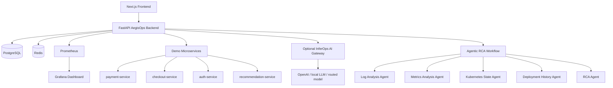

# AegisOps AI — Agentic AI Incident Commander for Production Systems

AegisOps AI is a portfolio-grade GenAI/SRE platform for production incident response. It turns alerts into multi-agent evidence collection, root-cause analysis, approval-gated runbooks, postmortems, RCA evals, and full Prometheus/Grafana observability.

This v3 version is designed to complement an LLM gateway such as **InferOps AI**:

```text
AegisOps AI = agentic production application
InferOps AI = LLM routing / safety / RAG / observability gateway
```

## What makes this project strong

- Multi-agent incident investigation workflow
- Live demo microservices with `/health`, `/logs`, `/signals`, `/metrics`, `/simulate-failure`
- RCA agent with optional InferOps AI gateway integration
- Evidence storage, agent traces, incident timeline, and runbook history
- Human approval before risky runbooks
- AI-generated postmortems
- RCA benchmark evaluation
- Prometheus + Grafana dashboard
- Dedicated pages for incidents, incident detail, postmortems, and evals
- Docker Compose end-to-end deployment

## Architecture



## Tech stack

| Layer | Tools |
|---|---|
| Backend | FastAPI, SQLAlchemy, PostgreSQL |
| Frontend | Next.js, TypeScript, Tailwind |
| Agents | Python agent classes, tool adapters, optional InferOps AI gateway |
| Demo services | FastAPI microservices with real Prometheus metrics |
| Observability | Prometheus, Grafana, OpenTelemetry instrumentation |
| Deployment | Docker Compose, Kubernetes manifests, GitHub Actions |

## Run locally

From the project root:

```powershell
cd deployment
docker compose down -v
docker compose up --build
```

Open:

| Service | URL |
|---|---|
| Frontend | http://localhost:3000 |
| Backend API docs | http://localhost:8000/docs |
| Prometheus | http://localhost:9090 |
| Grafana | http://localhost:3001 |
| Incident Center | http://localhost:3000/incidents |
| Eval Center | http://localhost:3000/evals |

Grafana login:

```text
admin / admin
```

## Demo flow

1. Open `http://localhost:3000`.
2. Select a scenario, for example **Payment API latency spike**.
3. Click **Create Scenario**.
4. Click **Run Agentic RCA**.
5. Review overview, evidence, agents, timeline, postmortem, and eval tabs.
6. Click **Approve Restart**.
7. Click **Generate Postmortem**.
8. Click **Run Eval Benchmark**.
9. Open Grafana and verify metrics.

## Demo microservice failure injection

Open:

```text
http://localhost:3000/incidents
```

Use the buttons under **Demo Microservice Failure Injection** to inject synthetic failures into:

- payment-service
- checkout-service
- auth-service
- recommendation-service

You can also call the backend directly:

```powershell
curl -X POST http://localhost:8000/demo-services/payment-service/simulate-failure
curl http://localhost:8000/demo-services/payment-service/signals
```

The evidence agents will read live signals from these demo services when available. If they are unavailable, AegisOps falls back to scenario fixtures.

## Optional: connect to InferOps AI

Create `.env` in the project root or export these variables before running Docker Compose:

```env
INFEROPS_AI_URL=https://your-live-inferops-url.com
INFEROPS_API_KEY=optional-token
OPENAI_MODEL=gpt-4.1-mini
```

Then run:

```powershell
cd deployment
docker compose up --build
```

AegisOps will call InferOps AI for RCA synthesis. If the gateway is unavailable, the deterministic fallback RCA keeps the project runnable.

## Important API endpoints

| Endpoint | Purpose |
|---|---|
| `GET /scenarios` | List incident scenarios |
| `POST /incidents/from-scenario/{key}` | Create incident from scenario |
| `POST /incidents/{id}/analyze` | Run agentic RCA |
| `GET /incidents/{id}` | Incident detail with evidence/traces/timeline |
| `POST /runbooks/approve` | Approval-gated runbook execution |
| `POST /incidents/{id}/postmortem` | Generate incident postmortem |
| `POST /evals/run-benchmark` | Run RCA benchmark |
| `GET /metrics` | Prometheus metrics |
| `POST /demo-services/{service}/simulate-failure` | Inject demo failure |

## Portfolio positioning

Use this GitHub subtitle:

> Agentic GenAI SRE platform for production incident triage, evidence collection, root-cause analysis, approval-gated runbooks, postmortems, evals, and observability.

## Resume bullet

> Built AegisOps AI, an agentic GenAI incident-command platform using FastAPI, Next.js, PostgreSQL, Docker, Prometheus and Grafana to automate production incident triage, live microservice evidence collection, root-cause analysis, human-approved runbooks, postmortem generation and RCA benchmark evaluation, with optional integration to an InferOps AI LLM gateway.

## Screenshots to add before publishing

Add screenshots under `docs/screenshots/`:

- frontend dashboard
- incident detail page
- evidence tab
- agent traces tab
- postmortem page
- Grafana dashboard
- backend Swagger docs

Then reference them from this README.

## Roadmap

- Add Loki for real log search
- Add Kubernetes API adapter for a local Kind cluster
- Add Slack/PagerDuty notification integration
- Add RAG over previous incidents and runbooks
- Add model cost/latency tracking from InferOps AI
- Add Terraform deployment for cloud hosting
